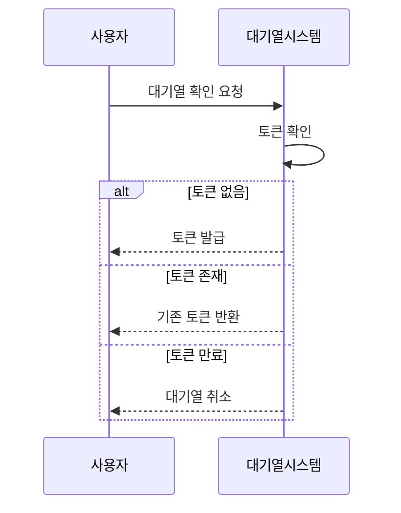
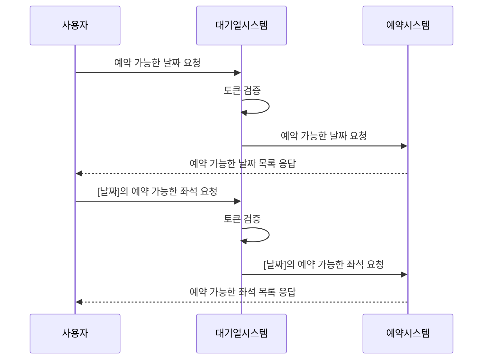
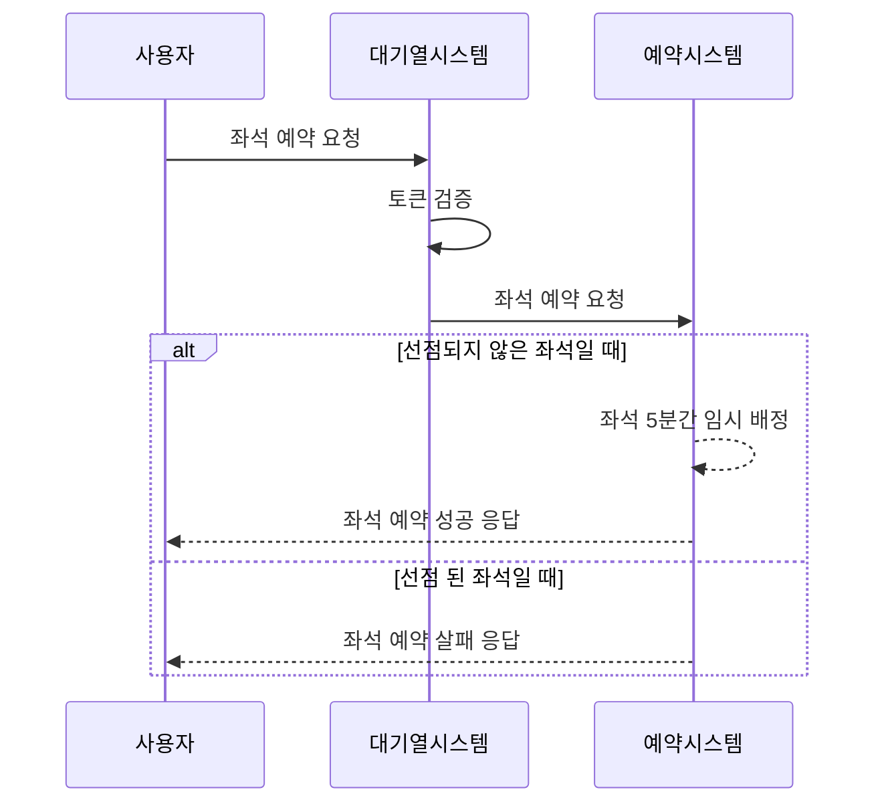
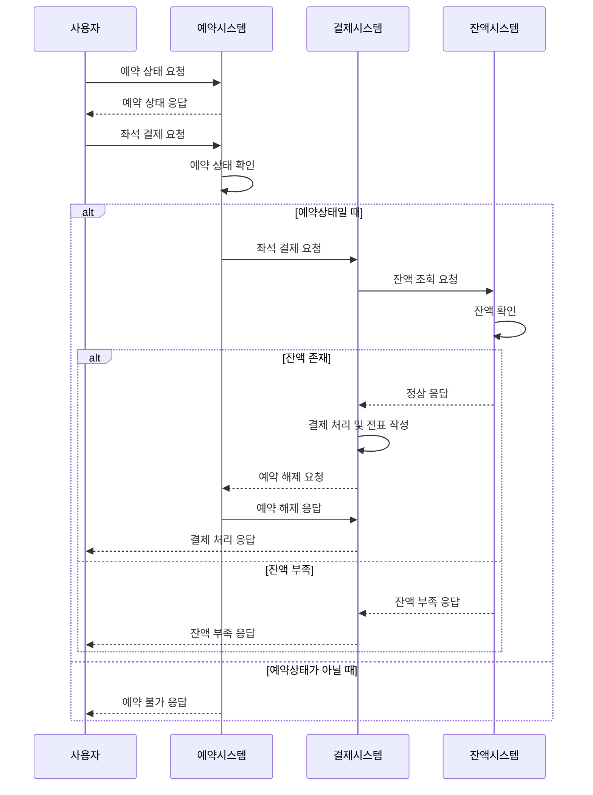
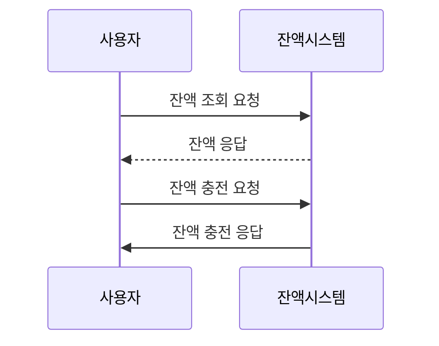
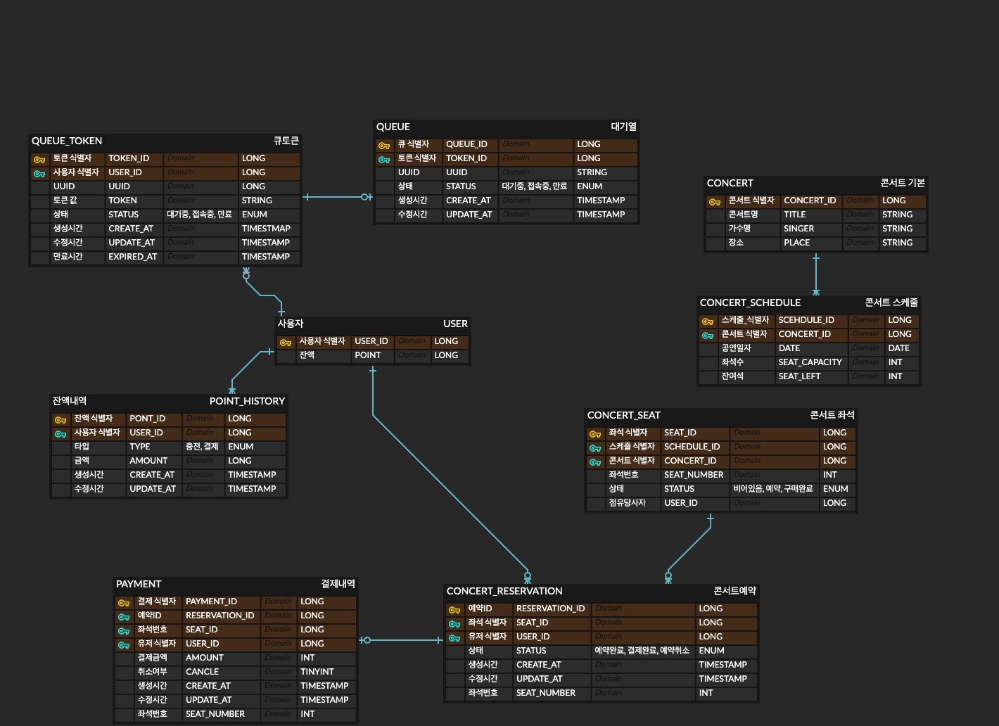

# 🚢 HHPLUS BE06
콘서트 예약 서비스

## Milestone
github Issue & Project로 관리합니다.

위 마일스톤은 2024.10.09 버전으로 과제 진행에 따라 유동적으로 변화할 수 있습니다. 
업데이트 된 버전은
[Link](https://github.com/users/yekk1/projects/1)
를 참고하세요.

## 시퀀스다이어그램
### 대기열 확인


### 좌석 조회


### 좌석 예약


### 좌석 결제


### 잔액 충전/조회


## ERD


## 기술 스택
- Java Spring Boot
- DB: MySQl + Redis
- API Docs: Swagger
- JPA, jwt ...
## 패키지 구조
```
api/
  <도메인>/ (concert, point, queue)
    controller.java
    request/
    response/
application/
  <도메인>/
    facade.java
domain/
  <도메인>/ 
    usecase/
    entity/
infra/
  <도메인>/
common
  config/
```
