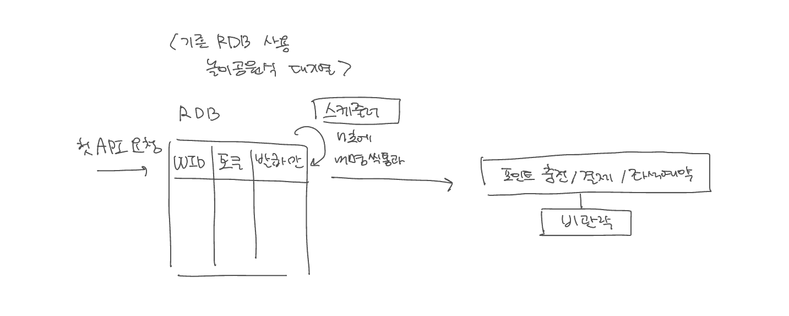

# 동시성 관리 개선 정리

### 1. 기존의 시나리오

1. 토큰이 없는 사용자가 첫 API를 요청하면 서버는 토큰을 발급해 RDB에 대기 상태의 토큰 정보를 담은 데이터를 쌓는다.
2. 스케줄러가 돌아가며 n초에 m명씩 가장 오래 된 대기중 상태의 토큰을 유효한 상태로 변화시킨다. (통과시킨다)
3. 유효한 상태의 토큰을 소유한 사용자는 자유롭게 API를 요청할 수 있다.

사용자의 관점으로 얼핏 보았을 땐 뮤지컬 티켓 예약이나 수강신청 시스템과의 큰 차이가 없어보이나 대기열을 통과한 m명의 사람들이 한 좌석을 함께 신청하거나 포인트 충전을 연속으로 요청하는 경우. 한 좌석의 결제 요청을 연속으로 보낸 경우 등의 동시성 문제가 생길 수 있다.

*(사실 내가 경험한 수강신청 시스템은 최초 1회가 아닌 강좌 선택 시 마다 대기열을 타야했던 차이도 있었다.)*

이를 해결 하기 위해 다음 조건을 추가 했다.

1. 포인트 충전, 결제, 좌석예약 로직에 비관적 락 (@Lock(LockModeType.***PESSIMISTIC_WRITE***))을 건다.

이제는 기능적으로 완벽해보인다! 하지만 여전히 문제가 존재한다.

우선은, 스케줄러는 단일 서버에서는 효과가 있을지 몰라도 분산서버에서는 각 서버마다 존재하기 때문에 내가 원하는 방식으로 작동하지 않을 가능성이 높다.

그 다음으로는 많이 들어왔다 싶이 비관적인 락은 해당 데이터를 참조하는 한 트랜잭션이 끝날 때 까지 다른 트랜잭션은 대기해야 하므로 동시에 여러 사용자가 접근하게 되는 경우(바로 이 콘서트 예약시스템!) 성능이 크게 저하될 수 있고, Dead락에 대한 위험성 또한 존재한다.

그리고 이전 주차에서 크게 데여봤다 싶이. 몇몇 DBMS는 존재하지 않는 데이터에 대한 잠금(갭락)을 지원하지 않아. 미리 레코드를 삽입해둘 수 없는 상황에서는 락이 제대로 작동하지 않는다는 큰 단점 또한 존재한다.

### 2. Redis의  Sorted Set 도입

위의 다양한 문제점들을 해결하기 위해 이번주차에서는 Redis의 Sorted Set을 도입하기로 했다.

1. 사용자가 요청을 보내면 Sorted Set에 토큰과 점수를 추가한다.
2. n초에 우선순위가 높은 m명의 요청을 가져온다. (대기열을 통과시킨다)
3. 유효한 상태의 토큰을 소유한 사용자는 자유롭게 API를 요청할 수 있다.
4. 성능을 개선하기 위해 동시에 여러사용자가 요청을 보낼 확률이 낮은, 즉 충돌 가능성이 낮은 포인트 충전/결제 API에는 낙관적인 락을, 좌석 예약 API에는 비관적인 락을 걸어둔다.

이전에 비해 훨씬 나은 구조처럼 보인다.

우선 RDB를 사용한 대기열 보다 인메모리 데이터 저장소인 Redis의 Sorted Set을 사용함으로써 성능면에서 개선될 것이라는 기대를 할 수 있다. 또, 대기열 관리를 Redis에서 제공하는 명령어를 사용하기만 하면 되므로 개발자 입장에서도 관련 로직을 구상하는데 드는 생각 비용이 크게 절감된다.

충돌 가능성이 낮을 것이라 예상되는 포인트 충전/결제 로직엔 낙관적 락을 적용하므로서 비관적락을 사용할 때보다 좀 더 나은 성능을 기대할 수 있다.

이정도면 전보다 크게 개선되었다고 생각했는데 성능면에서나 장애발생 확률면에서나 최대한 DB락의 사용을 지양하는 게 좋다는 피드백을 받았다.

또, 비관적 락을 마음껏 사용하려면 특정 DBMS에 의존적이게 되는 단점이 여전히 남아있다.

### 3. Redis의 Redis락과 Sorted Set 도입

1. 사용자가 요청을 보내면 각 API별로 사용자 정보와 점수를 쌓는다.
2. **놀이공원식이 아닌 은행창구 방식**으로 각 API 별로 가장 우선순위가 높은 요청을 가져온다.
3. Sorted Set을 통과한 요청은 Redis락을 획득 시도한다.
4. Redis락 획득에 성공한 각 요청을 수행한 뒤 Redis락을 해제한다.
5. 다음으로 가장 우선순위가 높은 요청을 가져온다
6. … 반복

뮤지컬 예약 시 자주 마주쳤던 “**이**미 **선**택된 **좌**석입니다.” 메시지를 생각하면 한 번에 여러 사용자가 통과하여 같은 비어있는 좌석을 보았을 것이라 생각했고 구상 초기엔 RDB로 대기열을 구성해야 했으므로 매 한명의 요청을 수행할 때마다 대기열 DB에 읽고 쓰는 연산이 비효율적이라고 판단했기에 놀이공원식 대기열 구성을 고집했다.

하지만 메모리를 사용해 성능이 굉장히 좋은 Redis로 대기열을 구성하는 것으로 바꾸었고, DB에 직접적으로 잠금을 걸어두지 않았기에 대기열을 통과한 m명의 사람들이 동시에 같은 레코드에 요청을 할 경우의 동시성 이슈를 방지하기 위해 은행창구식으로 구성을 바꾸었다.

이러면 초기 구성의 문제점을 모두 커버하는데 성공했다! 이제 직접 구현을 위해선 TTL 설정 등의 좀 더 세밀한 구상이 필요하다.

마지막으로 기본 Redis락 대신 Redlock 알고리즘을 사용하는 쪽으로 개선하면 분산환경에서 락의 안정성과 일관성을 더 강화할 수 있을 것이다.

